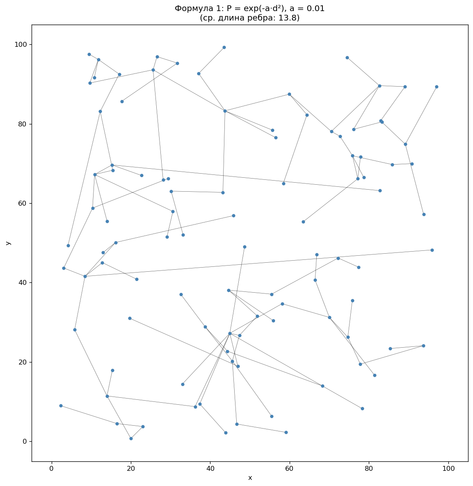
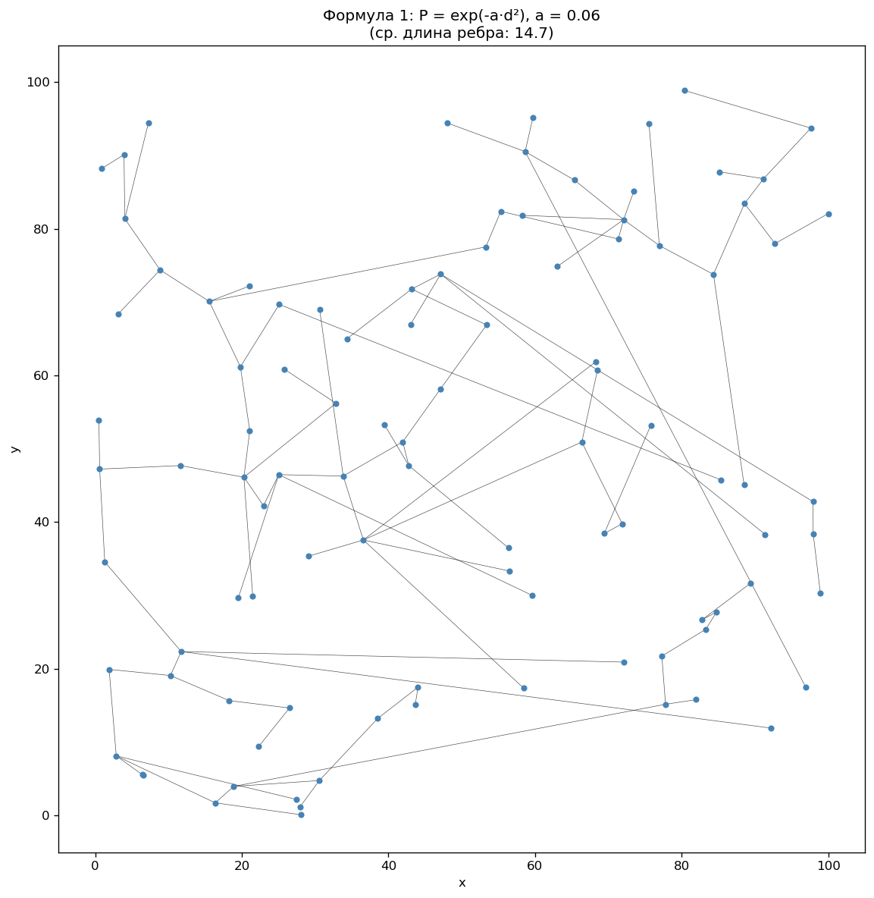
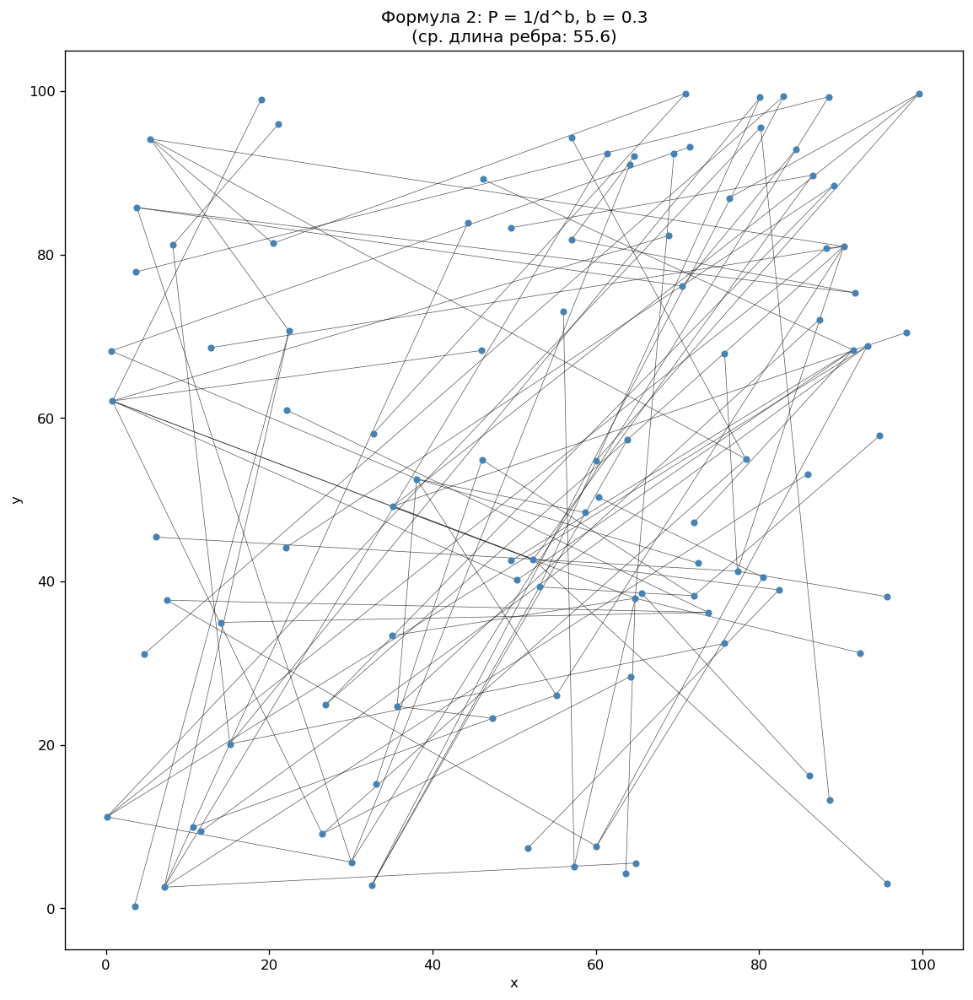
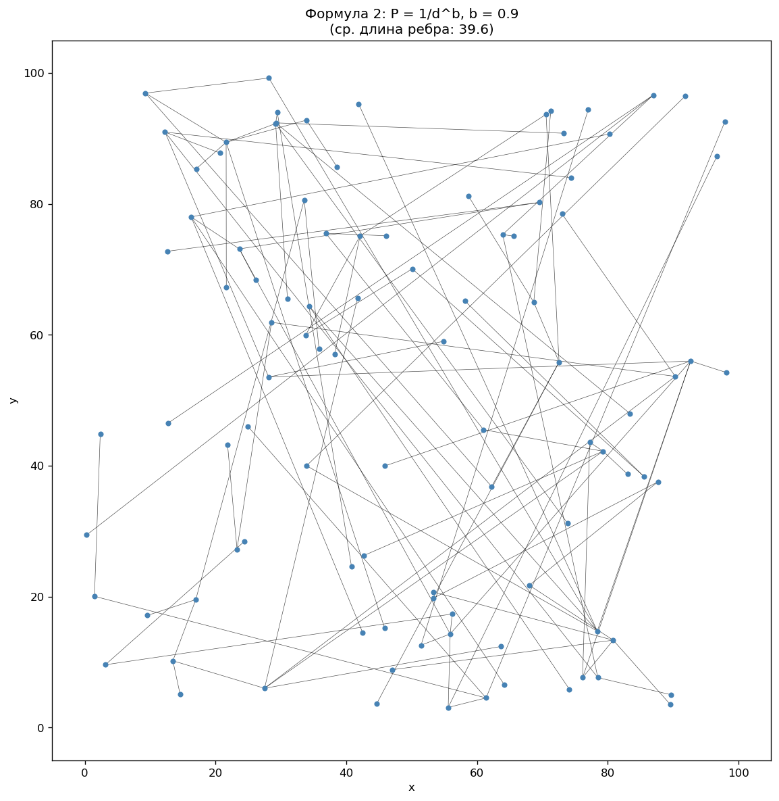
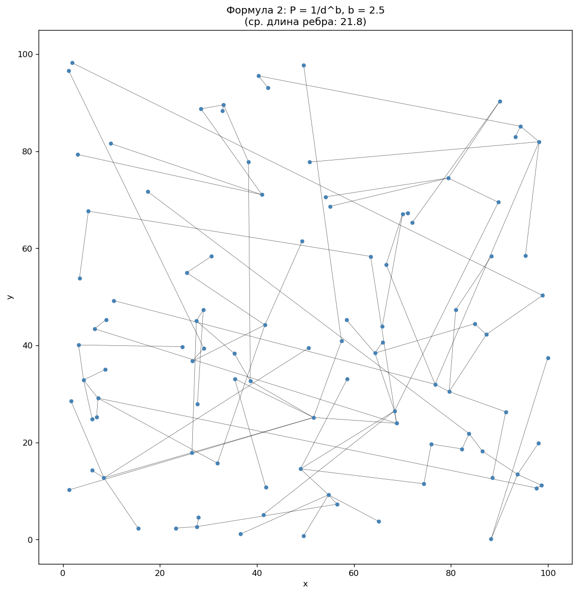

# Анализ графов (лаба 3)

**Содержание:** сводка по конфигурациям → сравнение (таблица) → выводы → выводы по серии → 8 выбранных графов → творческая часть.

---

## Сводка по конфигурациям

Построено графов: 4×50 для exp(-a·d²) и 4×50 для 1/d^b (в папках graphs/exp, graphs/pow). Во всех — 100 вершин, до 99 рёбер, циклов нет.

---

## Сравнение графов (разница по параметрам)

| Конфигурация      | Ср. длина ребра | Макс. степень |
|-------------------|-----------------|---------------|
| exp a=0.01           |               13.8 |                8 |
| exp a=0.06           |               15.9 |                5 |
| exp a=0.15           |               13.8 |                7 |
| exp a=0.4            |               12.3 |                8 |
| 1/d^b b=0.3          |               55.6 |                7 |
| 1/d^b b=0.9          |               43.7 |                7 |
| 1/d^b b=1.6          |               31.8 |                7 |
| 1/d^b b=2.5          |               21.7 |                7 |

**Кратко:** чем меньше a или b — тем длиннее рёбра и чаще хабы; чем больше — тем граф «локальнее». Циклов нет.

---

## Выводы

- С ростом параметра **a** или **b** средняя длина ребра **падает**, граф становится более локальным.
- При **малых** параметрах чаще появляются **хабы**.
- Обе формулы дают **похожее** поведение.

---

## Выводы по серии

По серии сгенерированных графов (по группе на каждую комбинацию формула–параметр):

| Формула   | Параметр | Ср. длина (mean ± std) | Макс. степень (mean ± std) |
|-----------|----------|-------------------------|----------------------------|
| exp        |       0.01 |                 16.4 ± 1.7 |                    7.3 ± 1.9 |
| exp        |       0.06 |                 14.7 ± 1.5 |                    6.9 ± 1.3 |
| exp        |       0.15 |                 13.8 ± 1.6 |                    6.6 ± 1.0 |
| exp        |        0.4 |                 11.7 ± 1.1 |                    6.4 ± 1.1 |
| pow        |        0.3 |                 48.5 ± 3.2 |                    7.6 ± 1.4 |
| pow        |        0.9 |                 39.5 ± 2.8 |                    7.3 ± 1.4 |
| pow        |        1.6 |                 28.6 ± 2.7 |                    7.4 ± 1.5 |
| pow        |        2.5 |                 21.7 ± 1.9 |                    7.1 ± 1.2 |

**Закономерности:** с ростом параметра a (или b) средняя длина ребра уменьшается — граф становится «локальнее». Максимальная степень может расти при малых a/b (появление хабов при более равномерном выборе длинных рёбер).

**На что похоже:** при малых a и b преобладают длинные рёбра и выраженные хабы — графы напоминают центр–периферию, транспортную или организационную сеть с узлами пересадок. При больших a и b рёбра в основном короткие, структура локальная — ближе к сенсорной сети, графу ближайших соседей или минимальному остовному дереву с пространственным предпочтением.

Графики сохранены: `images/batch_avg_edge_len.png`, `images/batch_max_degree.png`.

---

## 8 выбранных графов

В каталоге `images/interesting/` сохранены 8 графов:

| Формула | Параметры | Суть |
|---------|-----------|------|
| exp | a = 0.01, 0.06, 0.15, 0.4 | от длинных рёбер и хабов к коротким и локальным |
| 1/d^b | b = 0.3, 0.9, 1.6, 2.5 | то же для степенной формулы |

---

## Творческая часть: восемь графов и реальный мир

Меняли параметры — получали разные графы. Ниже восемь примеров: картинка и коротко простыми словами — что видно и на что похоже в жизни.

### Граф 1. Формула exp, малый a — длинные рёбра и «звезда»

На картинке много длинных линий и одна или несколько точек-«звёзд». В жизни: одна главная станция метро, один центр в компании. Маленький a — модель разрешает далёкие связи.

### Граф 2. Формула exp, переход

Несколько заметных узлов, смесь длинных и коротких рёбер. Как сеть с пересадками или несколько филиалов.

### Граф 3. Формула exp, переход

Промежуточный вариант: хабы и локальные «гнёзда». Коммуникационная или логистическая сеть.

### Граф 4. Формула exp, большой a — всё рядом

Рёбра короткие, связи с соседями. Сенсорная сеть, соседние дома. Большой a — только близкие связи.

### Граф 5. Формула 1/d^b, малый b

Длинные рёбра и хабы, как граф 1. Один центр — транспорт, организация, инфраструктура.

### Граф 6. Формула 1/d^b, переход

Несколько узлов, смесь рёбер. Сеть с пересадками, параметр b уже давит на расстояние.

### Граф 7. Формула 1/d^b, переход к локальности

Коротких рёбер больше. Часть связей централизована, часть — на соседях.

### Граф 8. Формула 1/d^b, большой b — только соседи

Почти все рёбра короткие. Сенсорная сеть, граф соседей. Большой b — далёкие пары почти не соединяются.

---

**Итог.** Чем больше параметр (a или b), тем «локальнее» граф. При малых параметрах — централизованные сети с хабами. Одну модель можно настроить под разные типы сетей — от метро с одним узлом до локальных сенсоров.
