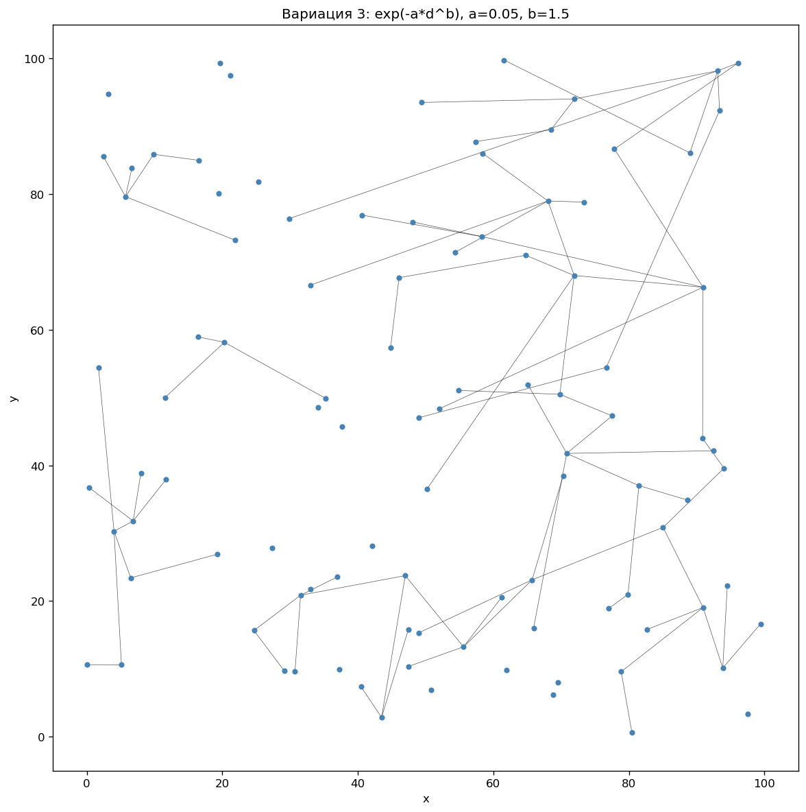
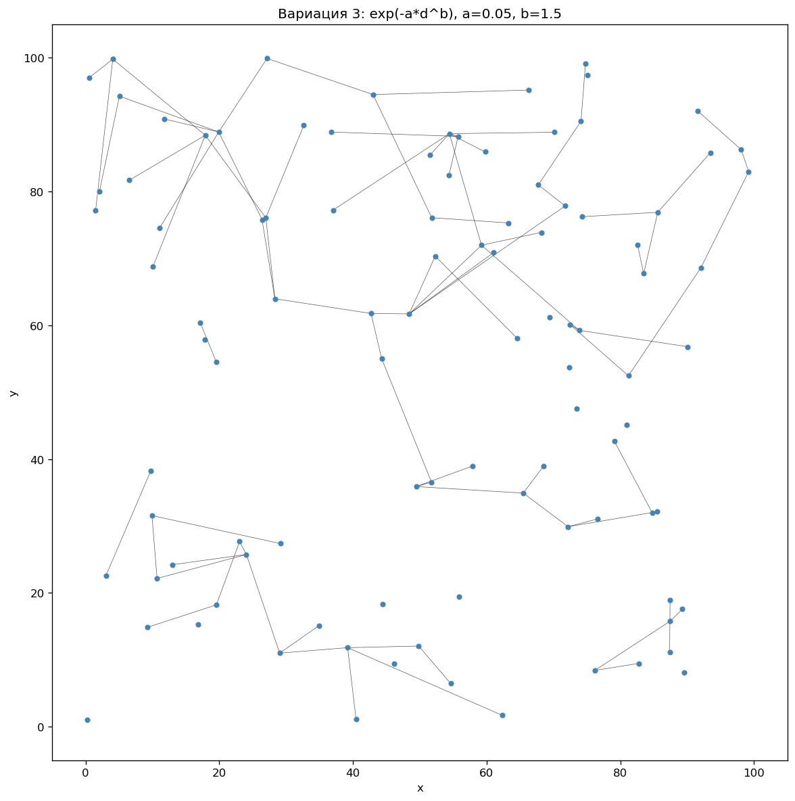
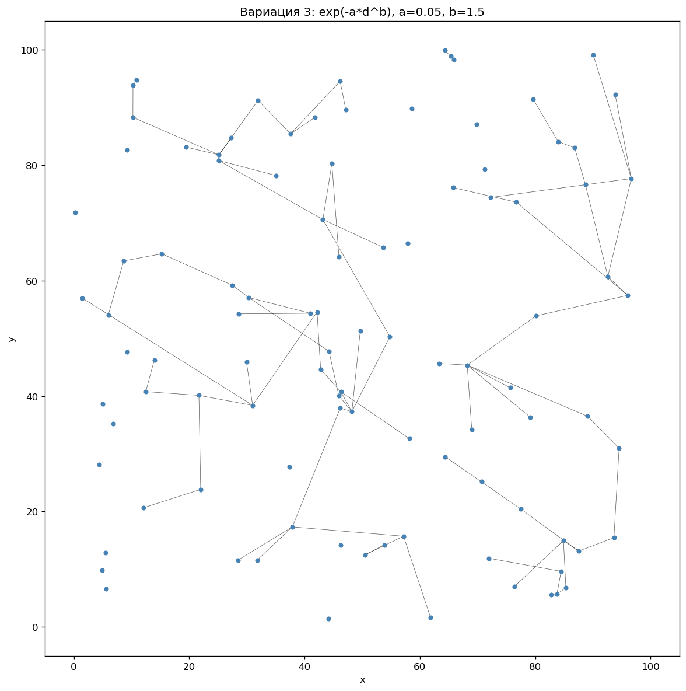
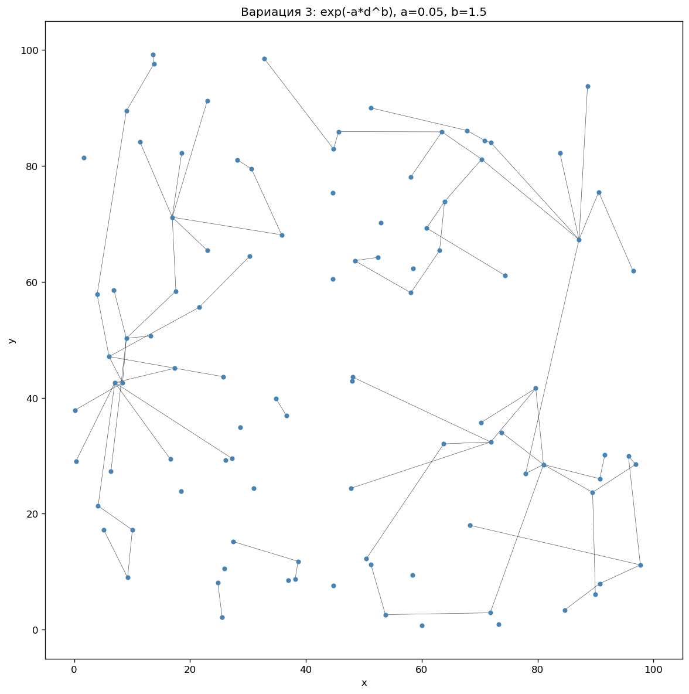
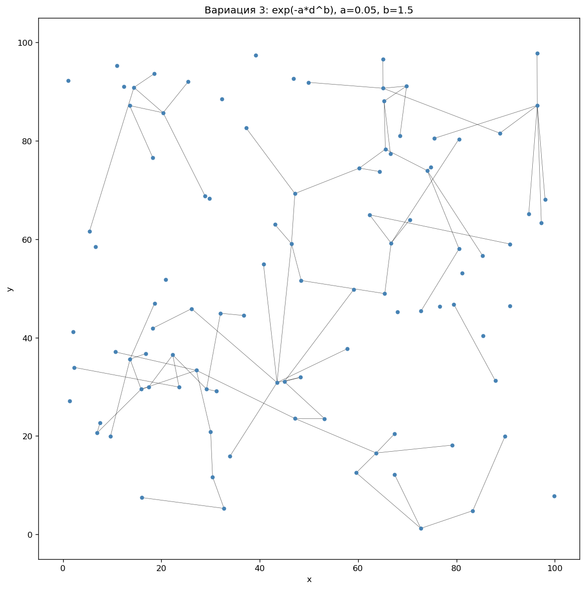
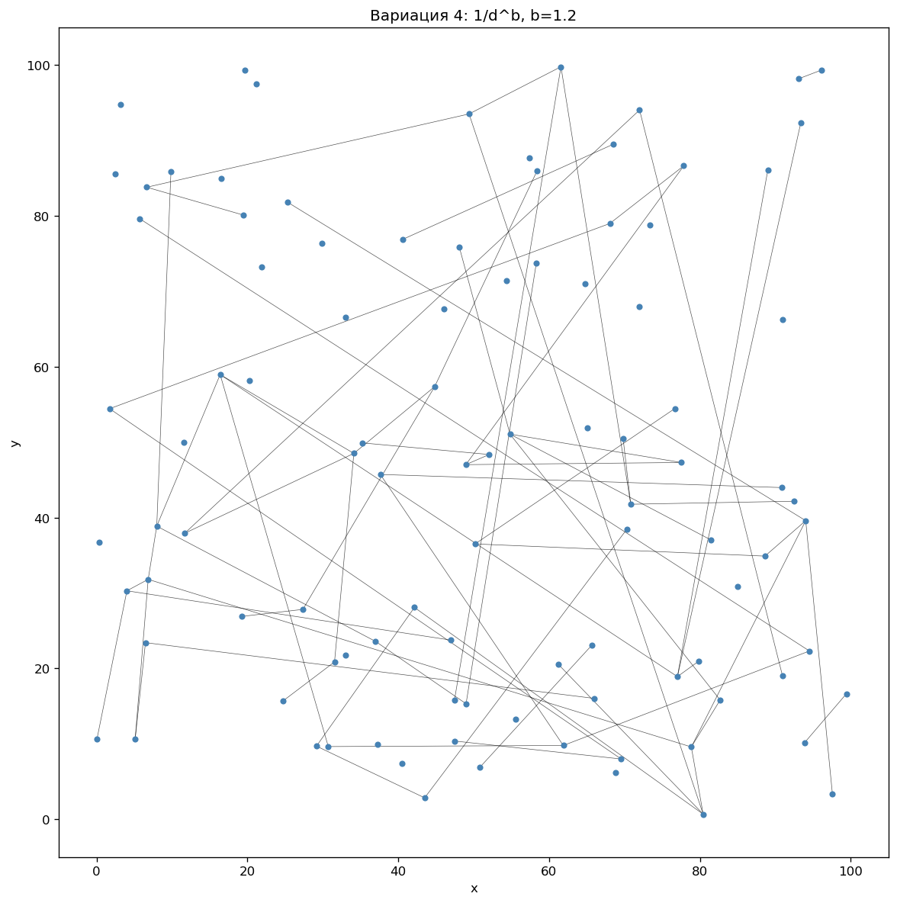
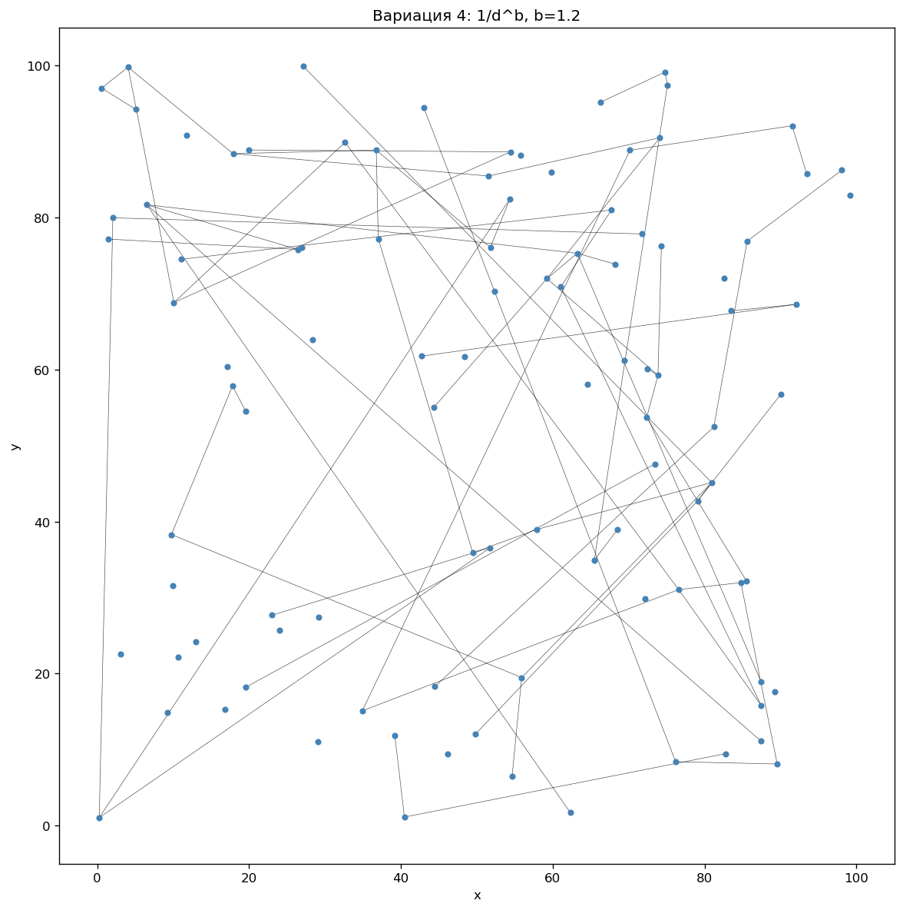
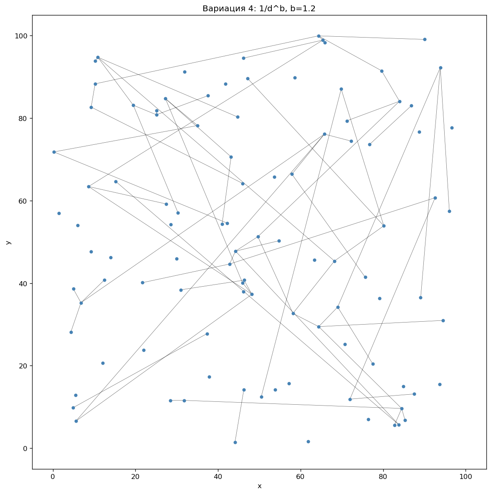
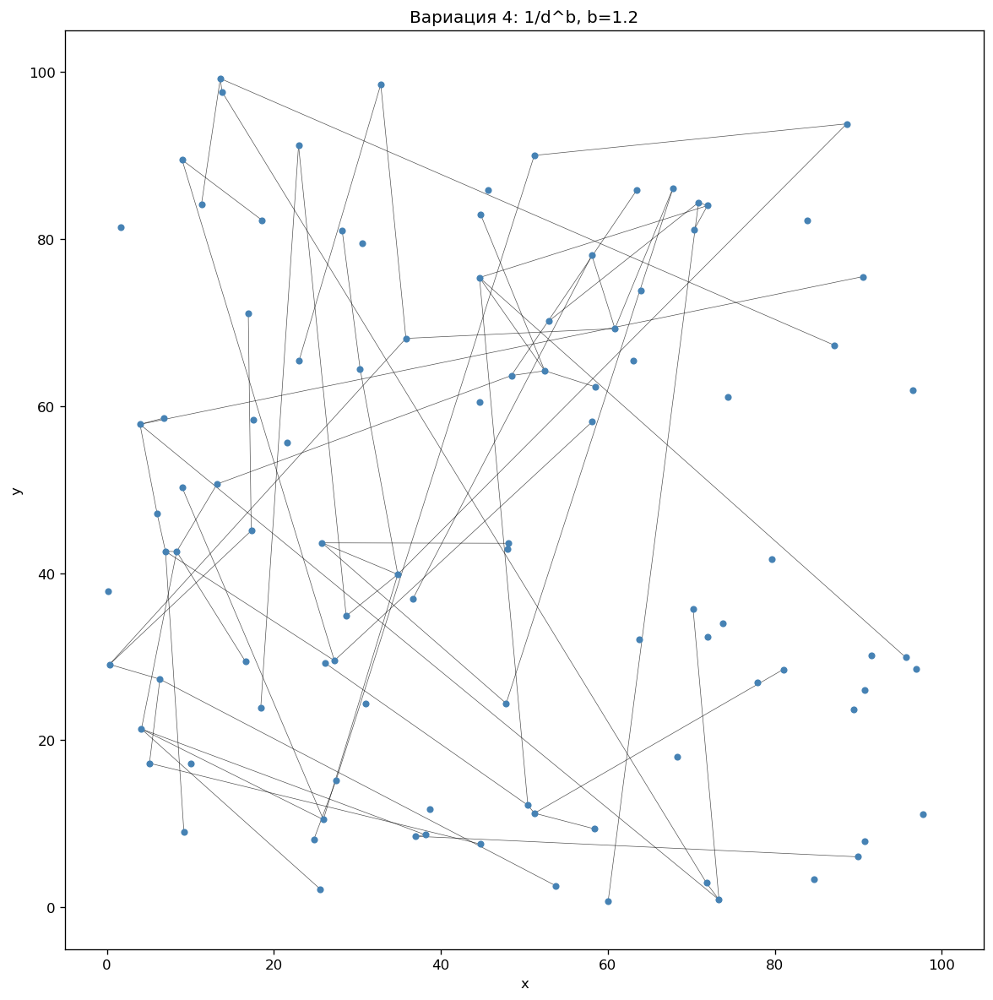
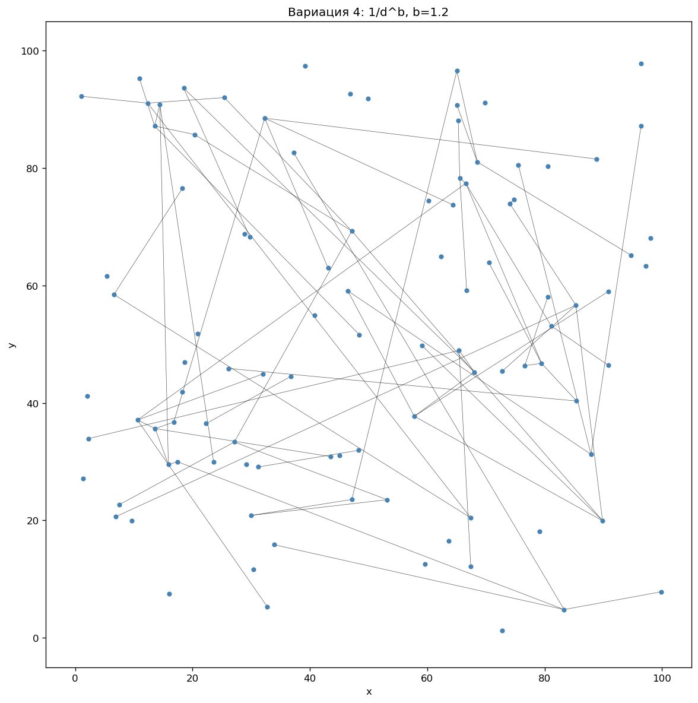

# 4 вариации × 5 графов

Сгенерировано 20 графов: по 5 на каждую вариацию.

## Вариация 1 (exp): экстремально глобальные связи и хабы

- Формула: `exp(-a*d^b)`, `a=0.002`, `b=0.6`
- На что похоже: Яркая сеть «центр–периферия»: много длинных рёбер и выраженные хабы.
- Где применимо: Транспортные сети с центральными узлами, иерархия филиалов, магистральные коммуникации.
- Связь с параметрами: Очень малый a и b<1 дают слабое затухание по расстоянию.

- По 5 графам: средняя длина ребра ≈ **52.3 ± 1.0**;
  макс. степень ≈ **7.2 ± 0.7**;
  число рёбер ≈ **99.0**.

---

## Вариация 2 (exp): экстремально локальная сеть

- Формула: `exp(-a*d^b)`, `a=1.2`, `b=3.8`
- На что похоже: Короткорёберная и разреженная сеть из соседей.
- Где применимо: Сенсорные сети, IoT на ограниченной территории, локальные mesh-сети.
- Связь с параметрами: Большие a и b резко подавляют дальние рёбра.

- По 5 графам: средняя длина ребра ≈ **3.5 ± 0.3**;
  макс. степень ≈ **2.6 ± 0.5**;
  число рёбер ≈ **24.0**.

---

## Вариация 3 (exp): средние по дальности связи

- Формула: `exp(-a*d^b)`, `a=0.05`, `b=1.5`
- На что похоже: Умеренная смесь локальных и дальних рёбер, средние хабы.
- Где применимо: Региональные сети, смешанная топология.
- Связь с параметрами: Средние a и b дают баланс между локальностью и дальними связями.

- По 5 графам: средняя длина ребра ≈ **12.7 ± 1.4**;
  макс. степень ≈ **5.8 ± 0.4**;
  число рёбер ≈ **80.0**.

---

## Вариация 4 (1/d^b): степенная модель, варьируется b

- Формула: `1/d^b`, `b=1.2`
- На что похоже: Структура зависит от b: малый b — дальние связи, большой — локальная.
- Где применимо: Модели с степенным затуханием по расстоянию.
- Связь с параметрами: В формуле 1/d^b варьируется только b.

- По 5 графам: средняя длина ребра ≈ **32.1 ± 2.7**;
  макс. степень ≈ **4.2 ± 0.4**;
  число рёбер ≈ **70.0**.

---
